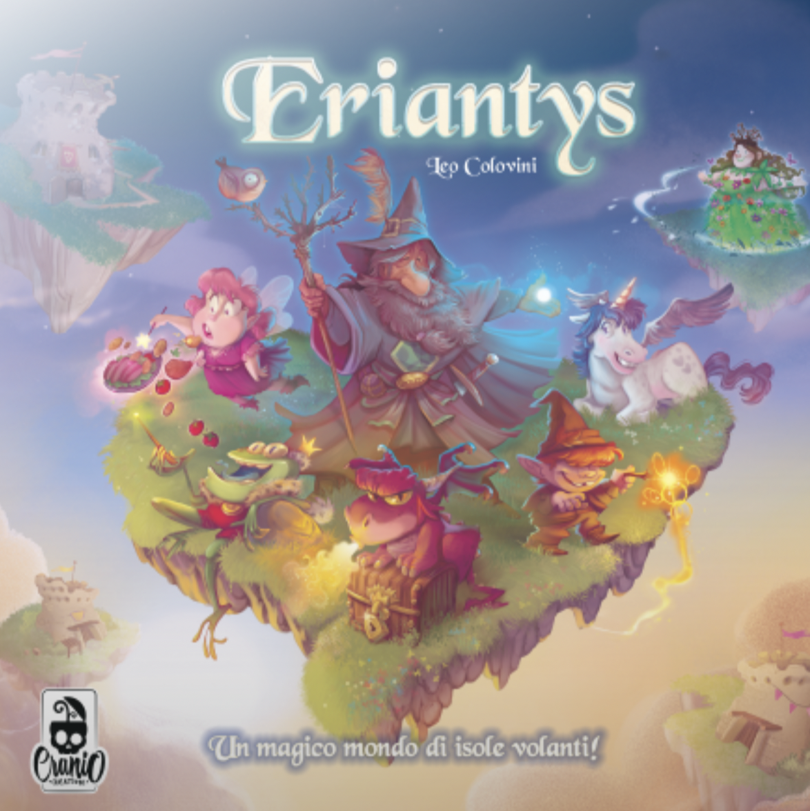

# Software Engineering Project 2022 - Eriantys



## Team members (AM06)
- Chiara Angileri
- Nicholas Beltramini
- Stefano Arcaro

## Project specification
The project consists of a Java version of the board game *Eriantys*, made by Cranio Creations.

You can find the full game [here](https://www.craniocreations.it/prodotto/eriantys/).

The final version includes:
* initial UML diagram
* final UML diagrams, automatically generated from the source code
* source code of the implementation
* source code of unit tests

## Implemented Functionalities
| Functionality     | Status |
|:------------------|:------:|
| Basic rules       |   🟢   |
| Complete rules    |   🟢   |
| Socket            |   🟢   |
| CLI               |   🟢   |
| GUI               |   🟢   |
| All 12 characters |   🟢   |
| Multiple games    |   🟢   |

## Test cases
All tests in model and controller has a classes' coverage at 100%.

**Coverage criteria: code lines.**

| Package    | Tested Class        |    Coverage     |
|:-----------|:--------------------|:---------------:|
| Model      | Global Package      | 1169/1216 (96%) |
| Controller | GameController      |  105/115 (91%)  |
| Controller | CharacterController |  70/70 (100%)   |
| Controller | InputController     |  67/67 (100%)   |

## Launch
This project's jar file can be found [here](https://github.com/StefanoArc/ingsw2022-AM06/tree/master/deliveries/jar).

Once the jar has been downloaded, in order to launch the application
you need to navigate to where the file was saved and run the following command:
```
java -jar eriantys.jar
```

Please take note that at least one server needs to be launched
before a client can connect to a game.